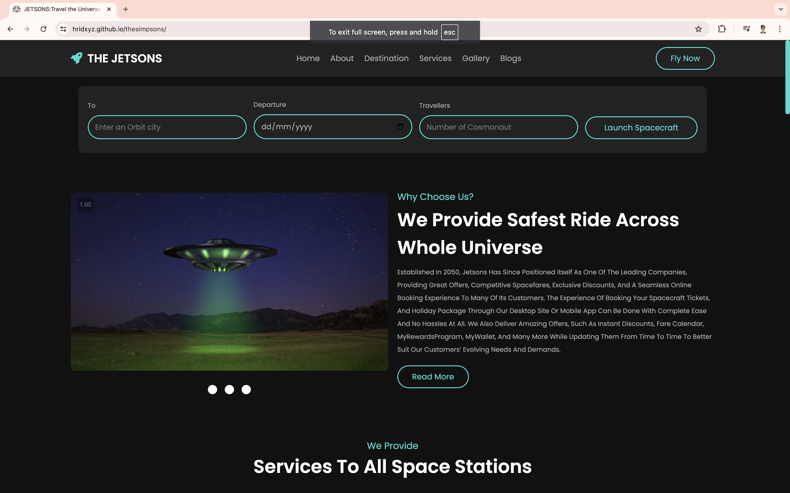
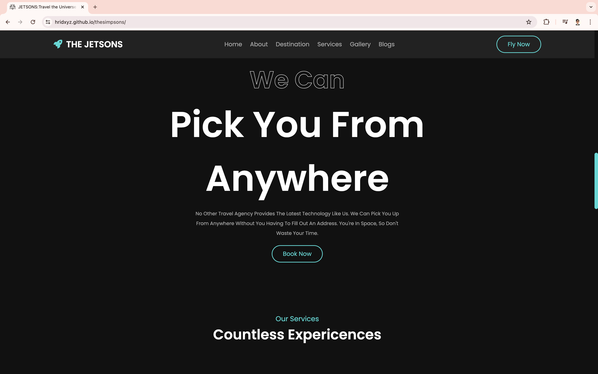
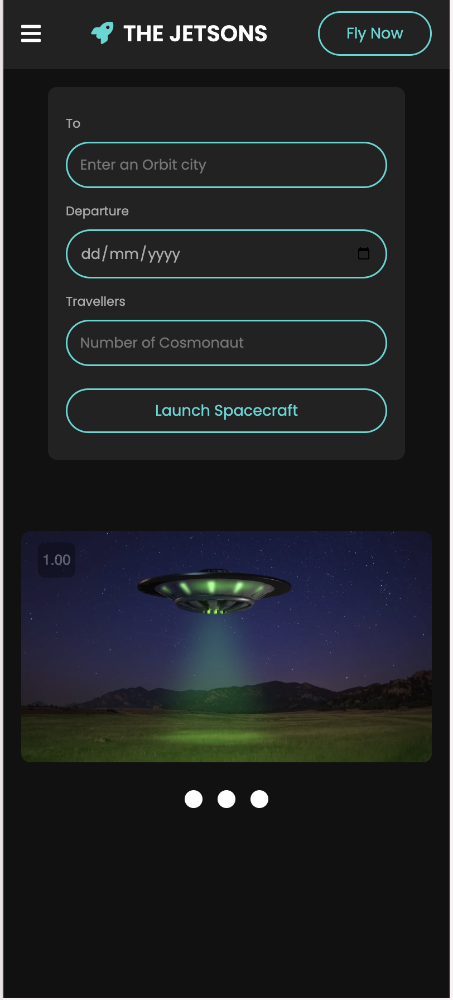

# The Jetsons: Travel the Universe


## Table of Contents
- [About the Project](#about-the-project)
- [Features](#features)
- [Tech Stack](#tech-stack)
- [Installation](#installation)
- [Usage](#usage)
- [Screenshots](#screenshots)
- [Contributing](#contributing)
- [Contact](#contact)

## About the Project

### Overview
The Jetsons is an innovative frontend-only travel platform designed to make interstellar travel easy and accessible. This project was developed during a competition and won the best prize, showcasing our initial stages of development skills. The Jetsons aims to provide a seamless booking experience for space travelers, offering a user-friendly interface and comprehensive travel options to various destinations across the universe.

### Background
The inspiration behind The Jetsons came from our fascination with space travel and the desire to create a futuristic travel booking platform. We wanted to combine our skills in web development with our love for science fiction to build something unique and exciting.

### Goals
- Provide a seamless and intuitive booking experience for interstellar travelers.
- Offer detailed information about various space destinations.
- Ensure a safe and enjoyable journey for all users.

### Achievements
- Awarded the best prize in a competition for innovative UI/UX design.
- Participated in the Web-Dev event organized under Techno Colosseum 2.0 by IEEE Student Branch Manipal, held from 17th August to 19th August, 2022, and received a certificate of appreciation.

## Features

- **Intuitive Search**: Easily search for and book flights to various orbit cities.
- **User-Friendly Interface**: Clean and modern design for a great user experience.
- **Detailed Destination Information**: Learn about different planets and space stations before booking.
- **Secure Booking**: Ensure safe and reliable booking of spacecraft.

## Tech Stack

- **Frontend:** HTML, CSS, JavaScript

## Installation

### Steps

1. Clone the repository
   ```sh
   git clone https://github.com/Hridxyz/thesimpsons.git
   ```
2. Navigate to the project directory
   ```sh
   cd thesimpsons
   ```
3. Open the `index.html` file in your browser to view the project.

## Usage

To start using The Jetsons, follow these steps:

1. Open the `index.html` file in your browser.
2. Enter your destination orbit city, departure date, and the number of travelers.
3. Click on "Launch Spacecraft" to search for available flights.
4. Browse through the list of destinations and select your preferred travel option.

## Screenshots

### Home Page


### Booking Interface


### Destination Details


### Responsive View


### Certificates


## Contributing

We welcome contributions from the community! If you would like to contribute to The Jetsons, please follow these steps:

1. Fork the repository
2. Create your feature branch (`git checkout -b feature/new-feature`)
3. Commit your changes (`git commit -m 'Add some feature'`)
4. Push to the branch (`git push origin feature/new-feature`)
5. Open a Pull Request

## Contact

**Hridxyz**
- GitHub: [@Hridxyz](https://github.com/Hridxyz)

Project Link: [https://github.com/Hridxyz/thesimpsons](https://github.com/Hridxyz/thesimpsons)
